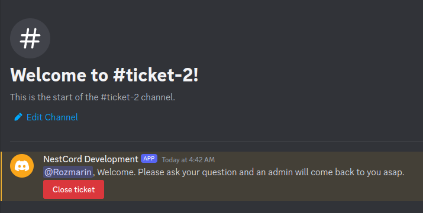

# Discord Ticket Bot

A simple bot for organizing tickets, written using the [NestCord](https://github.com/GlobalArtInc/nestcord) and [Discord.JS](https://github.com/discordjs/discord.js) frameworks.

## Prerequires
* Node 18+
* PostgreSQL
* Better LINUX, on windows doesn't testing

For debug:
* VScode
* Devcontainers
* Docker

## Debug

You can open the workspace inside the [devcontainer](https://code.visualstudio.com/docs/devcontainers/containers) in VSCode

```
export DISCORD_TOKEN=
export DISCORD_CHANNEL=
export DISCORD_GUILD= 
export DISCORD_ROLE=
export DB_HOST=
export DB_NAME=
export DB_USER=
export DB_PASS=
```

## Images
### Init command

### Ticket Page
